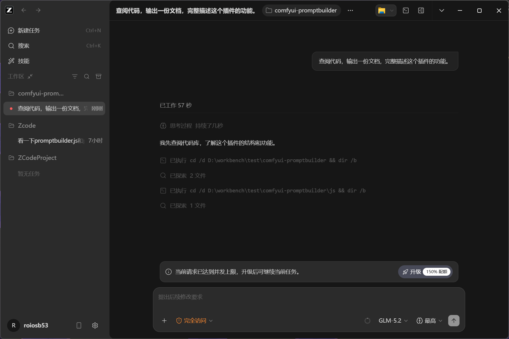

# PromptBuilder

ComfyUI 可视化提示词编辑器 — 分组、拖拽、芯片化组装 prompt，告别手敲逗号。



## 亮点

- **三级结构** — 分组 → 输入框 → 芯片，拖拽排序，权重 ±0.1 微调
- **词库** — 中英文分类管理，支持搜索；内置 3.7 万 Danbooru 标签 + 中文翻译，输入即时补全
- **BREAK 隔离** — 分组级开关，按需插入 BREAK 隔断 75-token 区段
- **Bypass** — chip 级旁路，悬停弹出工具栏（权重 / 旁路），× 常驻
- **一键翻译** — MyMemory / Google / 自定义 API 批量翻译未标中文的 chip
- **Token 统计** — 前端近似估算，超 75 / 150 分级提醒
- **撤销 / 重做** — 50 步（Ctrl+Z / Y），按节点隔离
- **每节点独立** — 提示词存节点自身，随工作流保存、拖图即载，多节点互不覆盖
- **词库导出** — JSON 文件备份或迁移；导入自动识别格式
- **暗色 / 亮色** — 主题切换，缩放可调，面板可收起

## 安装

将 `comfyui-promptbuilder` 放入 ComfyUI 的 `custom_nodes/`，重启。

```
ComfyUI/
└── custom_nodes/
    └── comfyui-promptbuilder/
        ├── __init__.py
        ├── nodes.py
        └── js/
            ├── promptbuilder.js
            └── danbooru-tags.json
```

无需额外依赖。需要 2024 年中之后的 ComfyUI（支持 `CLIP.encode_from_tokens_scheduled`）。

## 使用

1. 在 `conditioning/promptbuilder` 分类下添加 **PromptBuilder CLIP Encode** 节点，连上 CLIP
2. 点击节点上的 **✏️ 在 PromptBuilder 中编辑**，打开浮动面板
3. 左栏选词 / 搜索 → 点击或拖入工作区；中栏直接打字（逗号分隔），Tab 补全
4. 悬停 chip 弹出工具栏调权重或旁路；拖拽排序；双击编辑文本
5. 多节点独立：点击不同节点的按钮切换面板，互不覆盖

## License

GNU GPL v3
